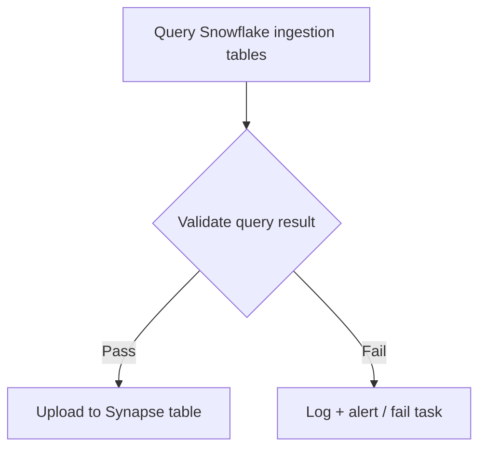

# Airflow DAGs — GENIE Data Pipelines

This directory contains Apache Airflow DAGs used to orchestrate GENIE data ingestion, transformation, validation, and publishing workflows across Snowflake and Synapse.

---

## Table of Contents

- [Patient Sample Tracking DAG](#patient-sample-tracking-dag)
  - [Overview](#overview)
    - [DAG Architecture](#dag-architecture)
    - [Output](#output)
    - [DAG Parameters](#dag-parameters)
  - [When This DAG Needs Modification](#when-this-dag-needs-modification)
    - [Scenario 1: A New Sponsored Project (SP) Is Added](#scenario-1-a-new-sponsored-project-sp-is-added)
    - [Scenario 2: A New BPC Cohort Release Is Added](#scenario-2-a-new-bpc-cohort-release-is-added)
    - [Scenario 3: Snowflake Schema Changes](#scenario-3-snowflake-schema-changes)
    - [Scenario 4: Synapse Table Schema Changes](#scenario-4-synapse-table-schema-changes)
  - [Troubleshooting](#troubleshooting)
    - [SIGTERM error](#sigterm-error)

---

## Patient Sample Tracking DAG

### Overview

The Patient/Sample Tracking Table DAG builds and publishes a unified tracking table containing all distinct (SAMPLE_ID, PATIENT_ID) pairs across:

- Latest MAIN GENIE release (consortium or public)
- Latest BPC cohort releases (one release per cohort)
- Sponsored Project (SP) datasets

The output Synapse table can be used for:

- Release membership tracking
- Cross-project overlap analysis
- Cohort/SP inclusion filtering
- Downstream QC and reporting

#### DAG Architecture

Most GENIE Airflow DAGs follow the same high-level pattern:

#### DAG Parameters

This DAG is fully parameterized using Airflow `Param` values:

| Parameter Name                        | Description                                       |
| ------------------------------------- | ------------------------------------------------- |
| `snowflake_genie_service_conn`        | Snowflake connection ID for GENIE service account |
| `synapse_conn_id`                     | Synapse connection ID (service account runner)    |
| `patient_sample_tracking_table_synid` | Target Synapse table ID to overwrite              |

#### Data Source

The input data source for this DAG are the clinical snowflake tables in the GENIE database under the `MAIN_GENIE`, `BPC_CLINICAL_FILES` and `[SP_PROJECT_NAME]`. 

#### Output

- Refreshes the [Patient/Sample Tracking Synapse Table](https://www.synapse.org/Synapse:syn73623767/tables/)

This table contains:

- One unique row per (SAMPLE_ID, PATIENT_ID)
- Boolean inclusion flags of whether each sample-patient pair exists in a fellow genie project release(MAIN/BPC/SP)
- Metadata information like release name

See table page for more info.

### When This DAG Needs Modification

This DAG typically requires updates under the following scenarios:

#### Scenario 1: A New Sponsored Project (SP) Is Added

When a new SP dataset becomes available, you must:

- Add a new `sp_<project>_pairs` Common Table Expression(CTE) block. See existing SP projects (e.g `KRAS SP project`) as an example.
- Add a new inclusion flag column `IN_<SP_PROJECT_NAME>_RELEASE` (e.g: `IN_AKT1_PROJECT`) in the wide CTE
- Add the new column `IN_<SP_PROJECT_NAME>_RELEASE` to `REQUIRED_COLS`

Example additions:

- SP_PIK3CA
- IN_PIK3CA_PROJECT

#### Scenario 2: A New BPC Cohort Release Is Added

When a new BPC cohort release becomes available, you must:

- Add a new inclusion flag column `IN_BPC_<COHORT>_RELEASE` (e.g: `IN_BPC_CRC_RELEASE`) in the wide CTE block
- Add a new `<COHORT>_RELEASE` name column in the wide CTE block
- Add both new columns to `REQUIRED_COLS`

#### Scenario 3: Snowflake Schema Changes

If upstream Snowflake tables change (column rename, new location):

- Update the corresponding CTE source table references
- Ensure (SAMPLE_ID, PATIENT_ID) extraction remains correct
- Re-run validation locally before deployment

#### Scenario 4: Synapse Table Schema Changes

If the Patient Sample Tracking Synapse Table Schema / data model is updated:

- Ensure query output matches the new schema by testing locally first
- Update `REQUIRED_COLS` accordingly

### Troubleshooting

#### SIGTERM error

Common causes:

- Memory issues

Actions:

- Retry with smaller `CHUNK` size
- If running on codespaces, may need to upgrade to a codespace with more memory